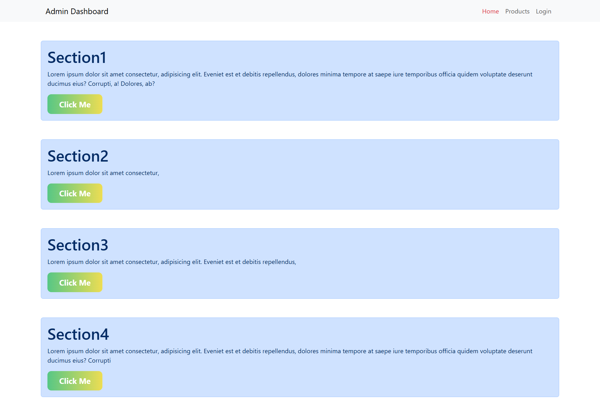
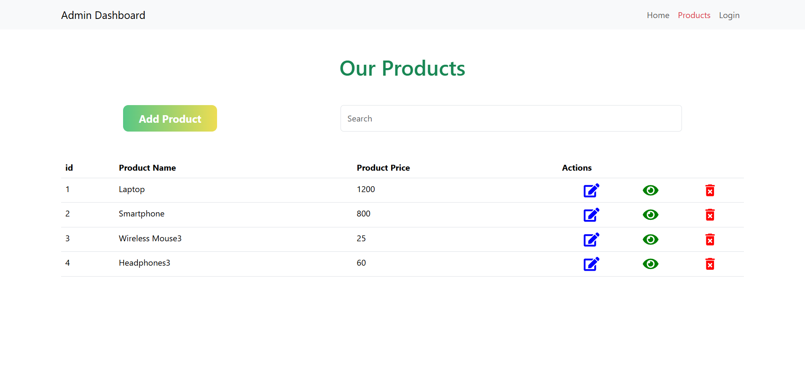
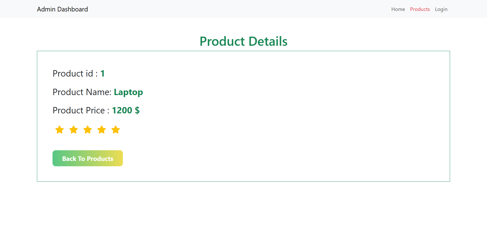
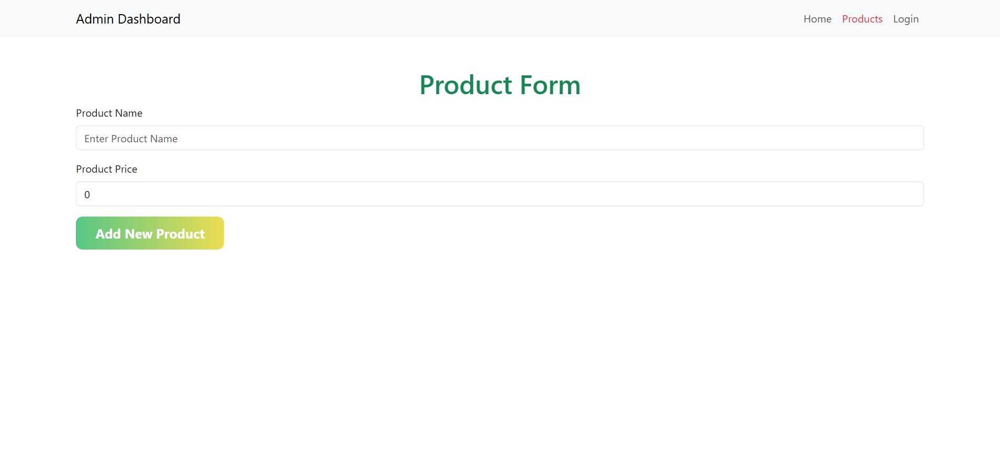
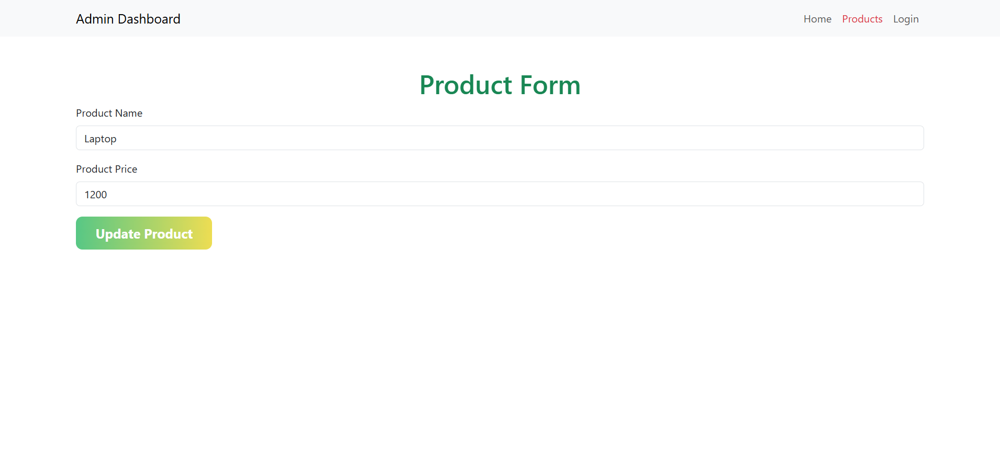

# ⚙️ CRUDS Management System

A simple yet powerful CRUD (Create, Read, Update, Delete) web application built with React.js and JSON Server.
It allows users to manage records efficiently with a clean, modern interface — perfect for learning and small-scale admin dashboards.

## 🚀 Features

### 🧩 Core Functionalities

- **Create**: Add new records dynamically through an interactive form

- **Read**: View and filter existing records from the mock backend

- **Update**: Edit existing data in real-time using modal forms

- **Delete**: Remove records with confirmation prompts

### 💻 Front-End Features

- **Built with React.js (Vite)** for fast rendering and modular structure

-**React Hooks** for state management (useState, useEffect)

- **Reusable Components** for tables, forms, and alerts

- **Bootstrap 5** for responsive layout

- **Fully client-side** — no real backend required

### 🎨 User Interface

- **Responsive Design**: Works seamlessly on desktop and mobile

- **Clean Layout**: Minimal and easy to navigate

## 🛠️ Technology Stack

### Frontend

- **React 19.1.1** - Modern React with latest features
- **Redux Toolkit** - State management for cart, user, and products
- **React Router DOM** - Client-side routing
- **Bootstrap 5.3.8** - Responsive UI framework
- **React Bootstrap** - Bootstrap components for React
- **Styled Components** - CSS-in-JS styling
- **Axios** - HTTP client for API calls
- **Vite** - Fast build tool and development server

### Backend

- **JSON Server** - RESTful API server for mock backend
 

## 📁 Project Structure

```

📦 
├─ Crads
│  ├─ .gitignore
│  ├─ eslint.config.js
│  ├─ index.html
│  ├─ package-lock.json
│  ├─ package.json
│  ├─ public
│  │  └─ vite.svg
│  ├─ src
│  │  ├─ Components
│  │  │  ├─ DivHome.jsx
│  │  │  ├─ Footer.jsx
│  │  │  ├─ Header.jsx
│  │  │  └─ MyTable.jsx
│  │  ├─ Custom
│  │  │  ├─ Api
│  │  │  │  └─ fetchApi.js
│  │  │  └─ MainButton.js
│  │  ├─ Layout
│  │  │  ├─ MainLayout.jsx
│  │  │  └─ SheredLayout.jsx
│  │  ├─ Pages
│  │  │  ├─ Home.jsx
│  │  │  ├─ NotFound.jsx
│  │  │  ├─ ProductDetails.jsx
│  │  │  ├─ ProductForm.jsx
│  │  │  └─ Products.jsx
│  │  ├─ assets
│  │  │  └─ react.svg
│  │  ├─ main.jsx
│  │  └─ store
│  │     ├─ index.js
│  │     └─ slices
│  │        └─ productSlice.js
│  └─ vite.config.js
├─ README.md
├─ screenshots
│  ├─ add.png
│  ├─ home.png
│  ├─ products.png
│  ├─ products_details.png
│  └─ update.png
└─ server
   ├─ .gitignore
   ├─ data.json
   ├─ package-lock.json
   └─ package.json
 
```

## 🚀 Getting Started

### Prerequisites

- Node.js (v14 or higher)
- npm or yarn package manager

### Installation

1. **Clone the repository**

   ```bash
   git clone https://github.com/Mariam433477/CRUDS-Operations
   cd CRUDS-Operations
   ```

2. **Install Backend Dependencies**

   ```bash
   cd server
   npm install
   ```

3. **Install Frontend Dependencies**
   ```bash
   cd  Cruds
   npm install
   ```

### Running the Application

1. **Start the JSON Server**

   ```bash
   cd server
   npm start
   ```

   The JSON server will run on `http://localhost:3005`

2. **Start the Frontend Development Server**

   ```bash
   cd Cruds
   npm run dev
   ```

   The frontend application will run on `http://localhost:5173`

3. **Access the Application**
   Open your browser and navigate to `http://localhost:5173`

## 📸 Screenshots

### 🏠 Home Page


_Display of all Sections

### 🔐 Products

### 🔐 Products Page

_Display of all products in a grid, includes search bar, filter options, and product cards inside div containers_

### 📄 Product Details Page

_Detailed product view  

### ➕ Add Product Page

_Form for adding new products with input fields for name, price, description, and submit button, all wrapped in div containers_

### ✏️ Update Product Page

_Form for editing existing product details


## 🔧 Development Scripts

### Frontend Scripts

```bash
npm run dev      # Start development server
npm run build    # Build for production
npm run preview  # Preview production build
npm run lint     # Run ESLint
```

### Backend Scripts

```bash
npm start        # Start JSON server (mock backend)
```

## 📱 Browser Support

- Chrome (latest)
- Firefox (latest)
- Safari (latest)
- Edge (latest)

## 🤝 Contributing

1. Fork the repository
2. Create a feature branch (`git checkout -b feature/AmazingFeature`)
3. Commit your changes (`git commit -m 'Add some AmazingFeature'`)
4. Push to the branch (`git push origin feature/AmazingFeature`)
5. Open a Pull Request

## 🙏 Acknowledgments

- Bootstrap for the UI framework
- React team for the amazing library
- Redux team for state management
- All open source contributors

---

**Simple CRUD System — Fast, Clean, and Functional ⚡**
